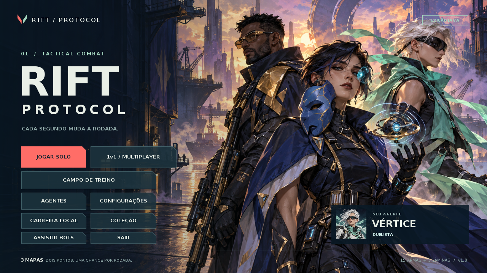

# RIFT Protocol · Java Edition

FPS tático em Java 17, com agentes, habilidades, economia por rodada e bots. A versão **1.8** adiciona duelos 1v1 por LAN/conexão direta e uma opção experimental para dois teclados e dois mouses no mesmo Windows.



## Jogar

Extraia o ZIP inteiro e abra **INICIAR_WINDOWS.bat**. Precisa de Java 17 ou superior. Para PC com dificuldade de desempenho, use **INICIAR_MODO_DESEMPENHO.bat**. Linux/macOS: `sh iniciar.sh`.

No menu, **JOGAR SOLO** abre o fluxo de modos e agentes; **CAMPO DE TREINO** abre o treino; **ASSISTIR BOTS** inicia uma partida autônoma. No observador, use Espaço para trocar de POV.

Para jogar com outra pessoa, use **1v1 / MULTIPLAYER**. Instruções de rede, internet e cadastro dos dispositivos estão em [MULTIPLAYER.md](MULTIPLAYER.md).

## Conteúdo

- 11 agentes com quatro habilidades por kit.
- 15 armas, três lâminas e coleção de cosméticos locais.
- Três mapas solo com sites e desníveis, mais três arenas de 1v1.
- Duelo primeiro a sete, troca de lados, revanche e equipamentos independentes.
- LAN/internet por endereço; duas janelas locais via Raw Input experimental no Windows.
- Seis modos locais, campo de treino e observação dos bots.
- Visão de 110°, mira gradual, audição, memória e decisões de duelo.
- Penetração de madeira/metal conforme arma, espessura e ângulo.
- Resolução interna automática, preset de desempenho e configurações de controles/acessibilidade.

## Desenvolvimento

```sh
java Build.java
java -jar RiftProtocol.jar --self-test
java -jar RiftProtocol.jar --duel-test
java -jar RiftProtocol.jar --duel-benchmark
java -jar RiftProtocol.jar --simulate-bots 6
java -jar RiftProtocol.jar --benchmark-bots
```

A compilação usa o JDK 17 e não baixa dependências. O JAR e as artes necessárias já vêm no ZIP. As configurações e o perfil ficam em `.rift-protocol` na pasta do usuário; extraia cada atualização numa pasta nova para preservar o pacote anterior.

## Documentação

- [Como jogar e controles](LEIA_PRIMEIRO.md)
- [Multiplayer: instruções e limites](MULTIPLAYER.md)
- [Mudanças da 1.8](CHANGELOG_1.8.md)
- [Mudanças da 1.7](CHANGELOG_1.7.md)
- [Desempenho e limites das medições](DESEMPENHO_1.7.md)
- [Roadmap e funcionalidades ainda planejadas](ROADMAP.md)
- [Verificação do pacote](VERIFICACAO.txt)

O multiplayer inicial é um duelo de armas, com habilidades desativadas. Internet exige um anfitrião acessível; não há matchmaking/relay hospedado. O rank, a progressão e o Premier continuam locais. A ponte de dois conjuntos do Windows exige validação física; veja MULTIPLAYER.md.
